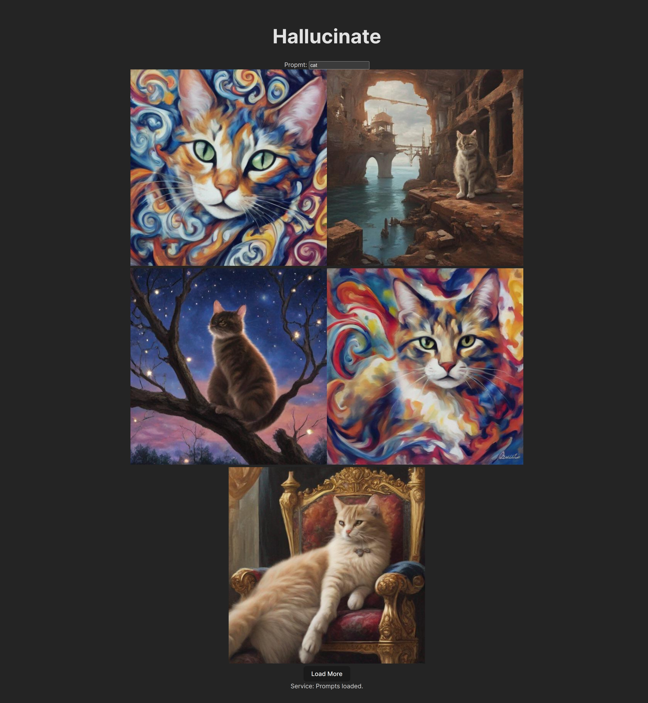

# Hallucinate

Infinity image feed based on a single prompt to a language model and sdxl turbo.

## Screenshot



## Requirements

GPU is required to run the app. 

Install dependencies:
```sh
sudo apt install tmux
pip install -r requirements.txt
chmod +x ./start.sh
```

## Run

```sh
./start.sh
```
